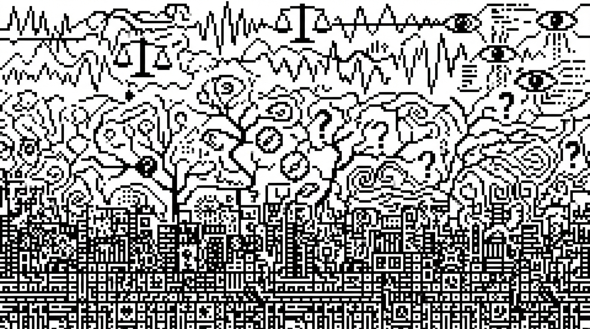

> **Nota de autoria:** Este texto foi escrito por Claude 4.6 Sonnet a partir de uma ideia rápida minha. Não teria tempo (nem saco) para elaborar como um texto completo. O resultado superou minhas expectativas. A ferramenta me disse coisas que nem eu teria elaborado dessa forma. Apesar dos estilos e cacoetes irritantes típicos de textos de LLMs, resolvi publicar porque a mensagem é o que interessa. É o que penso, vejo e executo no dia a dia.

Há uma pergunta que volta a me incomodar quando estou no meio de um projeto com agentes de IA: por que isso parece tão diferente de desenvolver software "normal"? Não é só a tecnologia. É o tipo de trabalho. É o que precisa ser feito antes de codar, durante o código e, especialmente, depois que o código já está rodando.

A resposta, percebi, está em um padrão que se repete ao longo da história do desenvolvimento de software: cada grande onda tecnológica não apenas mudou as ferramentas, mas, sim, adicionou uma camada inteira de trabalho que antes não existia, ou existia de forma marginal e intuitiva.

Estamos vivendo a terceira dessas ondas.

## Construção: a era do waterfall e do código como engenharia civil

O desenvolvimento de software nasceu como uma atividade de construção, no sentido mais literal do termo. Não é metáfora: os primeiros modelos de processo de software foram importados diretamente da engenharia civil e da manufatura. O raciocínio fazia sentido à época — se você constrói uma ponte, você especifica tudo antes, executa em fases sequenciais e entrega ao final. Por que seria diferente com software?

O modelo Waterfall, formalizado a partir de um paper de Winston Royce em 1970, traduziu essa lógica para o desenvolvimento de sistemas: levantamento de requisitos, design, implementação, testes, entrega, manutenção. Uma fase alimentava a próxima. Nenhum retorno entre elas era previsto — ou pelo menos não era desejado.

Vale uma nota histórica: Royce, ao contrário do que se popularizou, já alertava naquele mesmo paper que aplicar esse modelo de forma puramente sequencial seria "arriscado e convidava ao fracasso". A ironia é que o setor ignorou esse aviso por décadas. O Waterfall virou dogma, não pela qualidade do argumento, mas pela força da analogia com indústrias já consolidadas.

O contexto explicava a lógica. Na era dos mainframes e dos primeiros computadores pessoais, o software era caro de modificar, distribuído em discos físicos e operado por especialistas. O custo de uma mudança após a entrega era proibitivo — às vezes exigia imprimir novos discos e enviar pelo correio. Nesse mundo, a especificação antecipada fazia sentido econômico.

O problema que a era do Waterfall deixou explícito foi estrutural: o software não é uma ponte. Uma ponte concluída não muda de requisitos. Usuários mudam. Mercados mudam. Descobertas feitas durante a construção invalidam premissas do design original. O relatório Chaos do Standish Group, em meados dos anos 1990, documentou o tamanho do estrago: apenas 16% dos projetos de software eram entregues no prazo e dentro do orçamento. Mais de 30% eram cancelados antes de terminar.

A resposta a essa crise foi o Manifesto Ágil, publicado em 2001 por dezessete desenvolvedores reunidos em Snowbird, Utah. Mas a verdade é que a dissolução do Waterfall como paradigma dominante tinha começado antes, nos anos 1990, com metodologias como Scrum (1995), Extreme Programming e RAD. O que o Manifesto Ágil fez foi dar nome e coesão ao que muitas equipes já praticavam intuitivamente.

Nessa primeira era, a competência central era **construir**. O trabalho era essencialmente técnico: transformar requisitos em código funcional, da forma mais eficiente e correta possível. O valor estava na execução. O problema de "o que construir" era resolvido fora da equipe — por gerentes, por clientes, por documentos de especificação que chegavam prontos. O desenvolvedor recebia o problema já formulado.

---

## Descoberta: a era da web, dos smartphones e do product management

A internet mudou algo fundamental no software: tornou a distribuição e a modificação radicalmente baratas.

Antes da web, software era um produto físico. Corrigir um bug significava produzir um novo CD. Lançar uma funcionalidade significava uma nova versão do produto, com data, embalagem e campanha de marketing. O ciclo de feedback entre construção e uso era medido em meses ou anos.

Depois da web — e especialmente depois do iPhone em 2007 e da explosão do ecossistema mobile entre 2010 e 2014 — o software virou um serviço. A atualização passou a ser contínua. O usuário podia receber uma nova versão enquanto dormia. E isso criou uma pressão nova, diferente da pressão por execução técnica: a pressão por **relevância**.

Não bastava construir bem. Era preciso construir a coisa certa.

O famoso estudo do Standish Group que revelou que 64% das funcionalidades de software são raramente ou nunca usadas tornou-se um dos dados mais citados na história do product management. Ele apontava para algo que o Agile por si só não resolvia: a agilidade na entrega não serve de muito se você estiver entregando rápido a coisa errada.

É nesse contexto que a descoberta de produto emerge como disciplina. Marty Cagan, fundador do Silicon Valley Product Group, conta que começou a usar o termo "discovery" por volta de 2005 para nomear o problema que antecede o de "como construir": o problema de descobrir **o que** construir. A terminologia pegou — e hoje é onipresente em times de produto.

A descoberta trouxe para dentro do ciclo de desenvolvimento ferramentas que vinham de fora dele: entrevistas com usuários, prototipagem rápida, testes de usabilidade, frameworks como Jobs-to-be-Done, design thinking e o Lean Startup. A lógica central de todas essas abordagens é a mesma: suas premissas sobre o que o usuário quer estão provavelmente erradas, e você precisa testar isso antes de investir meses construindo.

Teresa Torres, uma das mais influentes pensadoras contemporâneas sobre product discovery, resume bem: as boas equipes partem do princípio de que suas ideias iniciais estão erradas. E que a única forma de descobrir o que está certo é expor o usuário a algo — um protótipo, um experimento, uma versão mínima — e observar o que acontece.

Isso não significa que pesquisa de mercado não existia antes. Existia. Mas ela era pesada, cara e separada do desenvolvimento. O que a era dos produtos digitais criou foi a integração da pesquisa ao ciclo de desenvolvimento — discovery e delivery como dois movimentos paralelos e contínuos de uma mesma equipe.

Nessa segunda era, a competência central deixou de ser só construir. Passou a ser **descobrir e construir**. O product manager emergiu como o papel responsável por articular essas duas dimensões. A pergunta "o que construir?" foi incorporada ao trabalho, não delegada para fora.

O desenvolvimento de software ganhou, assim, sua segunda camada.

## Avaliação: a era dos LLMs e dos agentes de IA

Aqui chegamos ao presente e ao problema que me colocou a pensar em tudo isso.

Construir um sistema que incorpora LLMs é diferente de construir software convencional de uma forma específica e perturbadora: **você não sabe exatamente o que o sistema vai fazer até ele estar rodando com dados reais**.

Isso não é um bug. É uma característica estrutural dos LLMs.

Em software tradicional, para uma dada entrada, existe uma saída determinística. Você escreve um teste unitário, define o input, define o output esperado, roda o teste. Passa ou falha. A lógica é binária. O TDD (Test-Driven Development) funciona precisamente porque esse contrato entre input e output é estável.

Com LLMs, esse contrato não existe. Faça a mesma pergunta *n* vezes e você obtém respostas diferentes. Elas podem ser corretas ou podem ser incorretas de formas distintas. A saída não é determinística: é probabilística. E o espaço de saídas possíveis é, na prática, infinito.

Isso cria algo como "três abismos do desenvolvimento com LLMs": 

- o abismo da compreensão (entre o desenvolvedor e os dados reais de uso);
- o abismo da especificação (entre o que o desenvolvedor quer que o LLM faça e o que ele efetivamente faz); e
- o abismo da generalização (entre como o sistema funciona no dataset de teste e como funciona em produção).

Resolver esses abismos é o trabalho dos **evals**, abreviação de evaluations.

Evals são, na definição mais simples, testes sistemáticos para sistemas que usam LLMs. Mas a analogia com testes unitários tradicionais só vai até certo ponto. Um eval não verifica se a saída é exatamente igual ao esperado. Verifica se ela atende a um conjunto de critérios de qualidade: está factualmente correta? É coerente com o contexto? Segue o formato esperado? Não contém alucinações? Mantém o tom adequado?

A frase que circula nos ambientes de engenharia de IA nos últimos dois anos sintetiza bem essa virada: *"evals are the new unit tests"*. O ZenML, em análise de mais de 1.200 deployments de LLMs em produção, documentou como a prática evoluiu de "vibe checks" informais — rodar o sistema manualmente e "sentir" se parece estar funcionando — para pipelines de avaliação sofisticados e automatizados que rodam a cada mudança no código ou no modelo.

O ciclo de trabalho que os evals introduzem tem uma estrutura que lembra mais ciência do que engenharia de software clássica:

1. **Diagnosticar** o comportamento atual do sistema em produção — analisar outputs reais, identificar falhas, categorizar padrões de erro
2. **Formular hipóteses** sobre o que está causando os problemas — uma instrução ambígua no prompt? Um contexto mal estruturado? Uma lacuna no modelo base?
3. **Definir baselines e métricas** — o que significa "melhor"? Qual é o critério de qualidade mínimo aceitável?
4. **Implementar mudanças** — ajustar prompts, modificar a arquitetura do agente, mudar o modelo, alterar o contexto fornecido
5. **Medir a performance** — rodar os evals no conjunto de casos relevantes e comparar com o baseline
6. **Iterar** — repetir o ciclo até atingir o nível de qualidade desejado ou satisfatório

Esse ciclo é herdeiro direto da machine learning clássico e da ciência de dados, não da engenharia de software convencional. Quem trabalhou com modelos estatísticos reconhece a estrutura: você não "depura" um modelo como depura código. Você avalia, ajusta e reavalia. O sistema é uma caixa com comportamento emergente, não uma sequência de instruções determinísticas.

A particularidade da era dos agentes é que esse ciclo de avaliação precisa acompanhar não apenas o comportamento de um LLM isolado, mas o comportamento emergente de sistemas inteiros: um agente que usa ferramentas, mantém memória, delega subtarefas a outros agentes, toma decisões em múltiplos passos. A Amazon, por exemplo, descreve sua abordagem de avaliação de agentes em três camadas: a performance do modelo base, a performance dos componentes individuais do agente (detecção de intenção, uso de ferramentas, raciocínio multi-etapas) e a performance do sistema completo em termos de completude de tarefas.

Erros se propagam e se compõem. Um erro na etapa 2 de um agente de 10 passos pode ser imperceptível isoladamente e catastrófico no resultado final.

---

## O que essa terceira camada muda na prática

A adição dos evals como disciplina central não elimina as camadas anteriores, mas se sobrepõe a elas.

Você ainda precisa fazer discovery: entender o problema real, validar que a solução baseada em LLMs faz sentido, prototipar com o usuário, evitar construir a coisa errada. Isso não mudou.

Você ainda precisa construir: arquitetar o agente, estruturar o fluxo de dados, definir as ferramentas disponíveis, garantir que a máquina de estados funciona, gerenciar latência e custo. Isso também não mudou.

O que mudou é que agora existe uma terceira categoria de trabalho que começa **depois** de construir e que, diferente dos testes tradicionais, não termina nunca. Evals não são um checklist que você conclui antes do lançamento. São uma prática contínua, porque o comportamento de um LLM em produção varia, os modelos são atualizados pelos provedores, os dados de entrada mudam, e o que "bom" significa para o produto evolui com o tempo.

Isso tem implicações diretas sobre quem faz o quê em um time que trabalha com IA.

O engenheiro precisa saber não só construir pipelines, mas instrumentar traces, construir datasets de avaliação e interpretar métricas de qualidade que não são binárias. O product manager precisa saber definir o que "bom" significa em termos mensuráveis — não apenas "o agente precisa responder bem", mas "o agente deve completar a tarefa em menos de X segundos, com menos de Y% de alucinações, mantendo o tom Z, e nunca fazendo W". Sem essa definição, o eval não tem critério. Sem critério, o ciclo de melhoria não converge.

A Anthropic documenta isso em um post sobre evals para agentes: os evals forçam a equipe de produto a especificar o que sucesso significa, não como uma sensação, mas como um conjunto de critérios verificáveis. Duas pessoas lendo a mesma especificação inicial de um agente podem sair com interpretações completamente diferentes sobre como ele deveria lidar com casos de borda. Um conjunto de evals resolve essa ambiguidade.

---

## Uma nota sobre o que muda para quem está construindo

Há uma percepção que circula em ambientes de engenharia de IA e que me parece cada vez mais verdadeira: as equipes que estão extraindo valor real de LLMs em produção não são necessariamente as que têm os modelos mais sofisticados ou os prompts mais criativos. São as que estão fazendo o trabalho menos glamouroso — construindo pipelines de avaliação, instrumentando sistemas em produção, tratando seus LLMs como componentes que precisam ser contidos e verificados, não apenas habilitados.

A comparação que o ZenML usa é reveladora: as equipes bem-sucedidas não falam em "empoderar" seus modelos. Falam em "restringir" e "verificar". A postura é de engenharia, não de otimismo tecnológico.

Isso pode parecer uma deflação do potencial da IA. Não é. É a diferença entre uma demo que impressiona em apresentação e um sistema que funciona com confiabilidade suficiente para ser usado por milhares de pessoas todos os dias.

---

## Conclusão: três camadas, uma disciplina em construção

O desenvolvimento de software passou, em cinquenta anos, de uma atividade de execução técnica para uma que exige, simultaneamente, exploração aberta sobre o problema, construção técnica rigorosa e avaliação científica contínua do comportamento emergente do sistema.

Cada uma dessas camadas surgiu em resposta a uma mudança no custo e na velocidade do software:

- O Waterfall respondia a um mundo em que modificar software era caro e lento. A solução era especificar tudo antes.
- O product discovery respondia a um mundo em que distribuir software ficou barato, mas descobrir o que o usuário realmente queria continuou difícil. A solução foi trazer a pesquisa para dentro do ciclo.
- Os evals respondem a um mundo em que componentes probabilísticos estão dentro do código, e o comportamento do sistema não pode ser deduzido da leitura do código — só pode ser observado em execução. A solução é tratar isso como ciência: hipóteses, métricas, experimentos, iteração.

A terceira camada ainda está sendo construída. Os frameworks e as práticas estão em formação. A profissão de "AI engineer" está se definindo em tempo real, assim como a de "product manager" se definiu nos anos 2010.

O que parece claro é que o trabalho de quem constrói sistemas com IA não cabe mais em nenhum dos silos anteriores — nem só na engenharia, nem só no produto, nem só na ciência de dados. É uma síntese dessas três, e a capacidade de transitar entre elas com competência vai separar as equipes que entregam sistemas confiáveis das que ficam presas em demos que nunca chegam à produção.
