Este é meu *portfolio* (se você caiu  diretamente aqui, sugiro [me conhecer](index.qmd) primeiro).

A seguir, reúno amostras tanto desde produções mais recentes (material instrutivo e artigos web) às mais antigas (reportagens para jornais impressos).

Clique nas imagens para acessar os originais em PDF.

## Tutoriais

A seguir, amostras de tutoriais criados para um curso de "Fundamentos de Programação", em 2022:

::: {layout-nrow=2}

[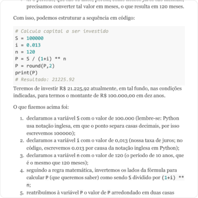](https://drive.google.com/file/d/1CWfKGbTi9M1DPFzEWmUorgABcUt6-j8d/view?usp=sharing)

[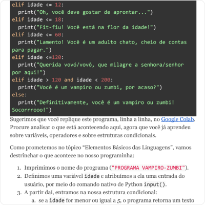](https://drive.google.com/file/d/1dWl04jeusGRgjPhevnACtO_iMhyjUwHe/view?usp=sharing)

[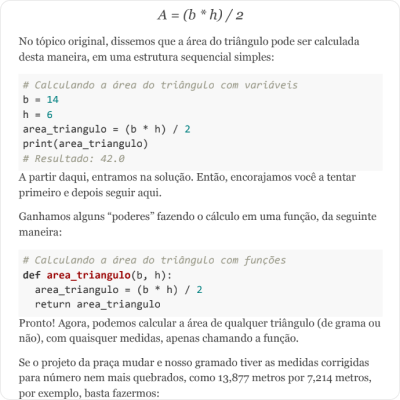](https://drive.google.com/file/d/16W_Wlwc-LBzaabvzEbN_oUH-5zK7fMac/view?usp=sharing)

[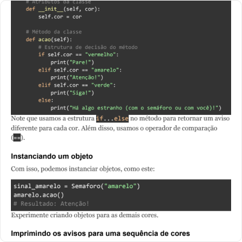](https://drive.google.com/file/d/1JwIc-CwAnUIR8JUcsLXbJEZMan7QFrB6/view?usp=sharing)

:::

Criei muitos tutoriais similares, geri a produção de outros e editei materiais em texto, slides etc. --- muitos deles de excelentes especialistas com colaborei --- para mais de 30 cursos, abrangendo as áreas de Programação, Dados, Design, Produto e Inovação e Gestão.

## Artigos instrutivos

Assim como os tutoriais, de viés mais prático, também produzi artigos instrutivos:

::: {layout-ncol=2}

[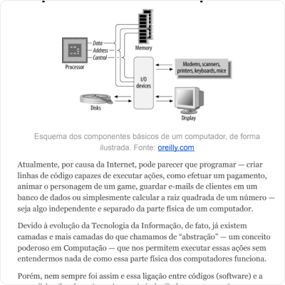](https://drive.google.com/file/d/1R752uZ_b1F9Pt92QFbBFv2nh4E6gXArZ/view?usp=sharing)

[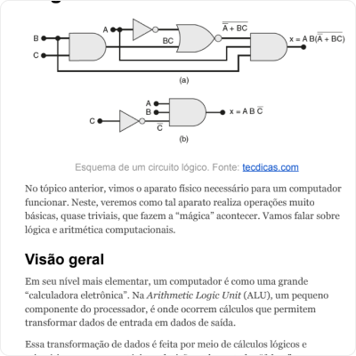](https://drive.google.com/file/d/1cRKRSv13Vpt6XnFMALo-dq44tMVMjjvJ/view?usp=sharing)

:::

## Artigos interpretativos

Os textos abaixo são de duas Newsletters que produzi ao longo de 2021. 

A proposta era de artigos mais densos e longos, com uma pegada analítica e interpretativa. É um dos tipos de trabalho que mais curto fazer.

::: {layout-nrow=4}

[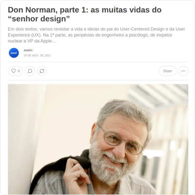](https://drive.google.com/file/d/1vdoscjiPLJpyPcko_fYnmpd0Dc6cVplp/view?usp=drive_link)

[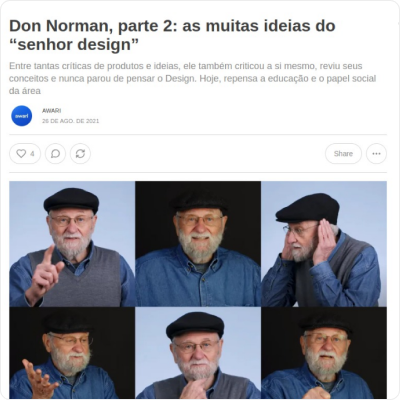](https://drive.google.com/file/d/1OoXCdK-40bVPu0UjWlzvvSP81zwkj0xT/view?usp=drive_link)

[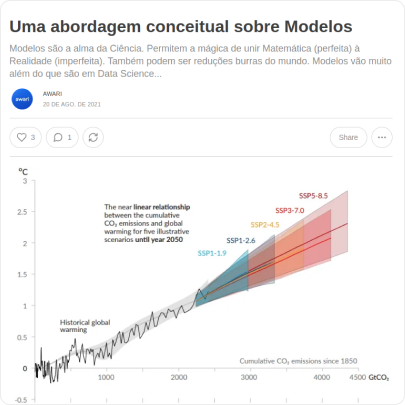](https://drive.google.com/file/d/1EeWWhkyEfzVOPvVI2HR0j11QVV4LXfQs/view?usp=drive_link)

[ como humano")](https://drive.google.com/file/d/1CxAnK_CdrO-bAB9D-agLMBIVtN2QkdUu/view?usp=drive_link)

[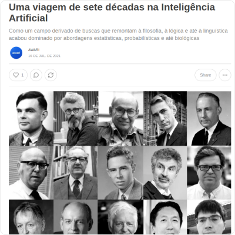](https://drive.google.com/file/d/1kNbWuLTuCK6XBaFU_lTzoDPgjN81-mpe/view?usp=drive_link)

[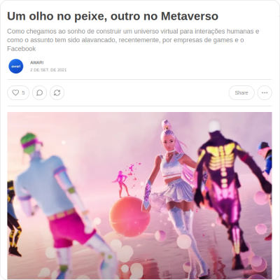](https://drive.google.com/file/d/1rf-k9oelhfSSt8So2lxGPCSwr1QjFbeo/view?usp=drive_link)

[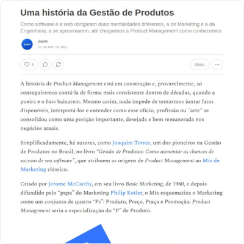](https://drive.google.com/file/d/105UqjlLz2MWO053XHHN6zzkuvNEti538/view?usp=drive_link)

:::

Praticamente todos esses textos continuavam disponíveis, ao menos até agosto/2023, nos seguintes endereços: [Awari Insights - Produtos e UX](https://awariprodutoux.substack.com/) e [Awari Insights - Dados e Tecnologia](https://awaridados.substack.com/).

## Artigos para blogs

Abaixo, seguem também alguns textos para blog. O primeiro é um artigo e o segundo é um tutorial.

::: {layout-ncol=2}

[: o que é e principais tipos")](https://drive.google.com/file/d/1oA4_mFw1itIYYs9mZt3UdI-wlmrmwTbg/view?usp=sharing)

[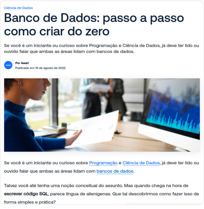](https://drive.google.com/file/d/1yqF-1dJuMumD0wf65ZppW1bcij4dGRdd/view?usp=sharing)

:::

Até a atualização desta página, em agosto/2023, ambos os artigos estavam disponíveis [neste](https://awari.com.br/banco-de-dados-nao-relacional/) e [neste](https://awari.com.br/como-criar-banco-de-dados/) links.

## Apresentação de slides

Embora textos corridos sejam meu forte, também me arrisco em apresentações, como esta, para apoiar uma aula introdutória de Engenharia de Dados:

::: {layout-ncol=2}

[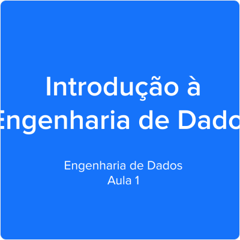](https://docs.google.com/presentation/d/e/2PACX-1vST6ZgwDjhUZymNOaB2U5kN2QefsypS4cAFc0kYzalbuDU8M-xnrMNHNTWInIxBPdgfSCR7N6q7HdU4/pub?start=false&loop=false&delayms=3000)

:::

## Projeto e gestão de conteúdo de website

Em 2016, quando atuava como coordenador na Secretaria de Comunicação da Prefeitura de Joinville (SC), integrei um projeto que me deu grande satisfação: arquitetar, notear e fazer um pouco o papel de PO (Product Owner) na construção de um novo site --- um "portal do cidadão" --- para o Município.

Abaixo, um print da tela inicial do site, como lançado em meados de 2016, e uma apresentação que foi feita na época, apresentando a novidade aos demais órgãos municipais. A última imagem é um exemplo de "Carta de Serviço" (print de agosto/2023) --- além de definirmos este modelo de informações, ajudamos os demais órgãos municipais no planejamento, criação e implementação de centenas de guias como esse aos usuários.

::: {layout-nrow=2}

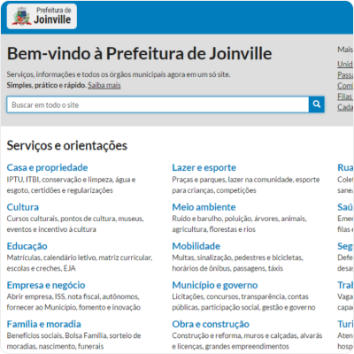

[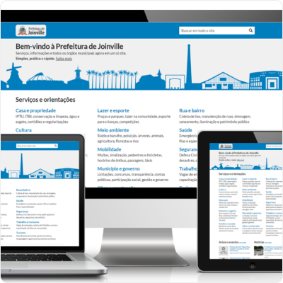](https://docs.google.com/presentation/d/e/2PACX-1vTKbosFQbMvoZWSmObIuCtVIhP64SRoS74k9_aSfWxx07p8fIVDa9ENrAnsJ_pOoepXMQFxq8474RX8/pub?start=false&loop=false&delayms=3000)

[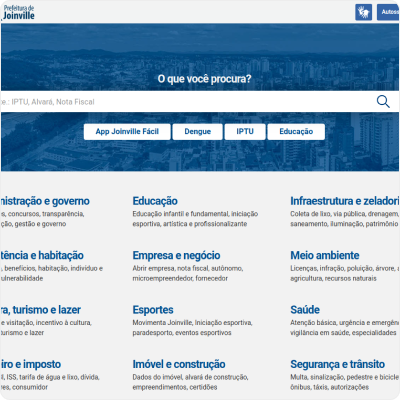](https://www.joinville.sc.gov.br/)

[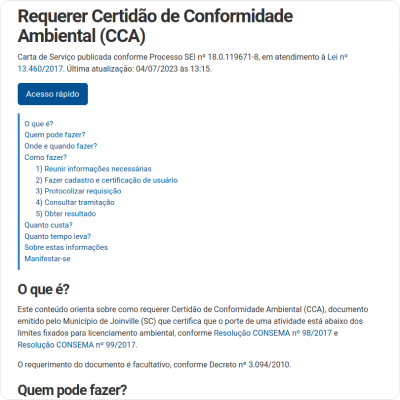](https://drive.google.com/file/d/1yaLLmyK5HQk5sMFnaWHteJiJ60OizWMb/view?usp=sharing)

:::

O site é: [joinville.sc.gov.br](joinville.sc.gov.br). O design teve leves mudanças (ficou melhor) e houve uma ou outra alteração conceitual desde lá, mas muitos dos princípios, como priorizar a busca em vez de banners, destacar "Cartas de Serviços" aos cidadãos --- guias de serviços que orientam como requerer e obter serviços públicos, como exige a Lei 13.460/2013 ---, entre outros, continuam ativos (pelo menos até a última atualização desta página, em agosto/2023).

Foi um período bacana de trabalho com pessoas como o Aurélio (dev), Charles (coordenador de TI e o Scrum Master do projeto), Edson (gerente de TI), Filipe (Diretor Executivo da Secretaria de Administração e Planejamento), Fred (dev), entre outros. Na operação do site, depois de lançado, teve uma galera de Comunicação, como Eva, Raquel, Mario, Elair, Angela e Matheus, que nutriram e/ou continuam nutrindo a base de conteúdos.

## Relatórios analíticos

Entrei na Prefeitura de Joinville (SC) em 2014 como Coordenador de Ouvidoria, um desafio e tanto na época --- até então, já acumulava quase 10 anos como repórter de jornais impressos, conhecia a Administração Pública como jornalista, mas não sabia dos desafios que a gestão pública guardava. Foi um aprendizado novo a cada dia, acabei me tornando gerente, entregando muita coisa e desejando ter entregue mais.

Abaixo, amostra de relatório analítico que produzi para a Secretaria de Saúde, com base em dados da Ouvidoria, em 2015. Toda a coleta e análise de dados, bem como texto, infográficos e diagramação são meus. O Jornalismo de Dados, pelo qual me interessava desde 2011, no fundo foi o que me fez ser chamado para a Administração Pública e me ajudou em trabalhos como esse.

::: {layout-ncol=2}

[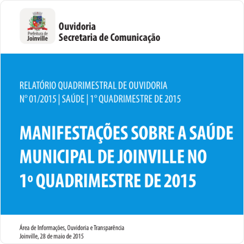](https://drive.google.com/file/d/1ifa8YWnEcKZllZ-AoraAqnV1fZtWzqZf/view?usp=sharing)

:::

## Trabalhos jornalísticos

A seguir, exemplos de algumas das muitas reportagens produzidas na minha trajetória como repórter de jornais impressos (onde debutei aquelas famosas 10.000 horas que te tornam bom ou razoavelmente bom em alguma coisa).

### Série de reportagens

Abaixo, exemplo de série de reportagens sobre saúde pública em Joinville (SC), que culminou com um debate sobre o Hospital Municipal São José, que atende toda a região Norte/Nordeste de Santa Catarina:

::: {layout-nrow=2}

[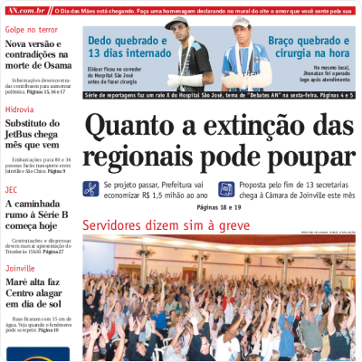](https://drive.google.com/file/d/15ZeK1wHJx_3g1DeEp3bVyIsrqUxegoN7/view?usp=sharing)

[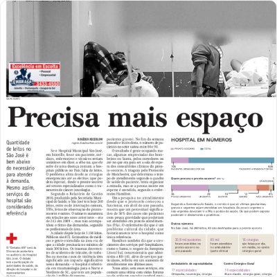](https://drive.google.com/file/d/1GrusLnIm2iVaHS9Pq-bkcc9__viwj5do/view?usp=sharing)

[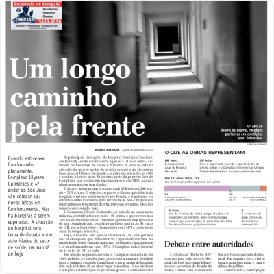](https://drive.google.com/file/d/1KVEO_Wt_cf0u1y1Q5QqjbSXSJTM-3W50/view?usp=sharing)

[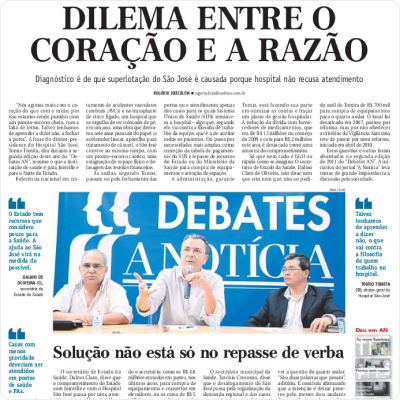](https://drive.google.com/file/d/1S73AaCRk58JHSK8FtnwwbsAZWyQXtozV/view?usp=sharing)

:::

### Reportagens e matérias avulsas

E, aqui, amostras de reportagens e matérias avulsas, cujos PDFs tinha, sei lá por que motivos, em um antigo álbum no Issuu:

::: {layout-nrow=2}

[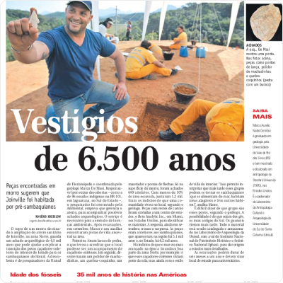](https://drive.google.com/file/d/1f1KIw3BDpMG8_Kptv-jExP8x247hDD1l/view?usp=sharing)

[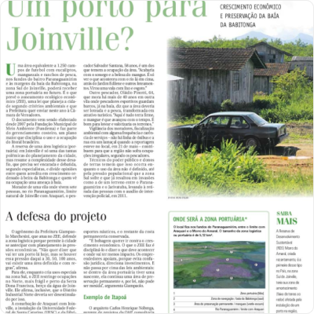](https://drive.google.com/file/d/1fBfo5WmuQjdjImTXGRUjgUqfbpgD0MbO/view?usp=sharing)

[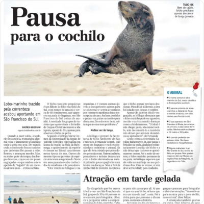](https://drive.google.com/file/d/1sq3gkxmMfPly7UCGVuU9CJuAxi5P3G6z/view?usp=sharing)

:::

Uma curiosidade: uso Google Docs praticamente desde 2005, quando foi lançado. Então, tenho praticamente os originais de tudo o que fiz na minha vida de jornalista, um banco de dados e tanto. Só não me preocupei em salvar os PDFs dos trabalhos após publicados 🤦‍♂️.

Um dia, quem sabe, ainda vou me aventurar no Arquivo Histórico de Joinville para garimpar outros trabalhos da época, mesmo que só por nostalgia.

## Adendos

Se eu encontrar outros materiais ou produzir novos, tentarei disponibilizá-los aqui. Caso você ou outra pessoa ache que isso viola direitos autorais ou fira qualquer regra ou bom senso, entre em contato no meu LinkedIn ou [neste formulário](https://forms.gle/3to7Vt8XJGtJJB248) para resolvermos da melhor forma.

Obrigado por navegar nesse breve baú de praticamente 20 anos de carreira.